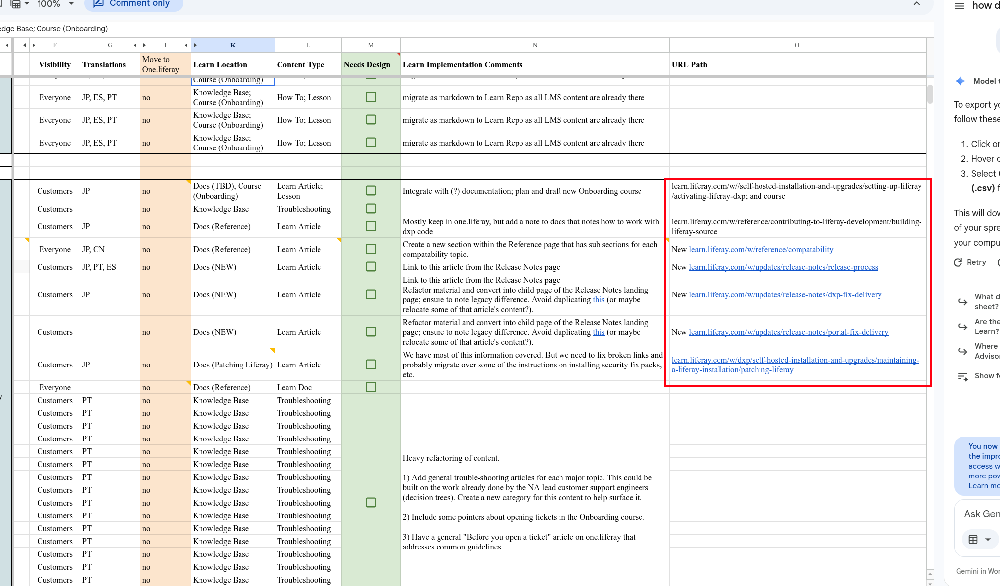

# Transform

Once articles are exported (see EXPORT.md), we need to decide what happens to each one based on its Content Type.

## Content Type Routing

The Content Type isn't in the API response — we need a mapping file (`content-types.json`) that matches each article's `friendlyUrlPath` to its Content Type.

| Content Type | Where it goes | Format | What to do |
|---|---|---|---|
| `Knowledge Base` | Liferay Object Entries | JSON | Keep the HTML body as-is. Export metadata + HTML as JSON. |
| `Knowledge Base; Course (Onboarding)` | Object Entries + Confluence | JSON | Same JSON export as KB, but also flag it for Confluence. |
| `Docs (TBD)`, `Docs (Reference)`, `Docs (Search)`, `Docs (NEW)`, `Docs (Patching Liferay)` | `liferay-learn/docs` | Markdown | Convert HTML to Markdown. Write `.md` files with frontmatter. |
| `Course (Onboarding)` | Confluence | — | Not handled here. Goes through the Confluence course workflow. |

## Knowledge Base → JSON

KB articles get exported as JSON. No Markdown conversion. The HTML body stays raw for the Object Entry API.

```
/output/kb/{lang}/article-slug.json
```

Schema:
```json
{
  "externalReferenceCode": "360054766052",
  "title": "Article Title",
  "friendlyUrlPath": "article-slug",
  "language": "en-US",
  "availableLanguages": ["en-US", "es-ES"],
  "htmlBody": "<h2>...</h2><p>...</p>",
  "category": "25988291",
  "folderId": 27408740,
  "keywords": ["tag1", "tag2"],
  "taxonomyCategoryBriefs": [ ... ],
  "dateCreated": "2025-09-16T22:57:47Z",
  "dateModified": "2026-03-20T22:27:31Z"
}
```

## Docs → Markdown

Docs get saved inside the `liferay-learn/docs/` directory. The exact path shoul be shown here in the docs


```
/liferay-learn/docs/{lang}/article-slug.md
```

**Content field**: match by `fieldReference: "content"` or `label` starting with `"Content"`. The body is in `contentFieldValue.data`.

## Image Handling

TBD. Videos (YouTube iframes) should work as-is. Internal Liferay image paths need a strategy — download them or leave them hosted.
